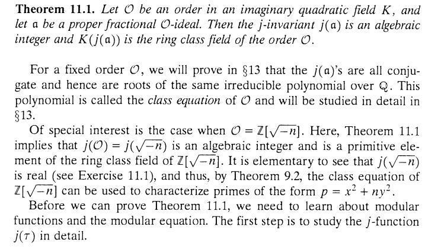

Using the system prompt we provided before, here is the result we get from the agent.

### 1. Document Thesis
The thesis studies the factorization of $J(d_1,d_2)$, the product of differences of CM $j$-invariants, building on Gross–Zagier, Dorman, and Lauter–Viray. Lauter–Viray reduced the prime valuations of $J(d_1,d_2)$ to a count of invertible ideals of fixed norm in a (possibly non-maximal) imaginary quadratic order, but only proved a clean formula when the norm is coprime to the conductor. Geiger's contribution is to count *all* integral ideals — and then *invertible* integral ideals — of fixed prime-power norm in an arbitrary imaginary quadratic order, as a step toward removing that coprimality hypothesis.

### 2. Document Type & Character
This is a pure-mathematics master's thesis in algebraic number theory / arithmetic geometry, in the tradition of complex multiplication and singular moduli. Chapter 2 is expository (results stated, proofs cited); Chapter 3 is the original work and is proof-driven, mostly via careful local computations in $\mathcal{O}_p = \mathbb{Z}_{(p)}[\tau]$ for non-Dedekind orders. Reading it requires following definition–lemma–theorem chains and tracking case splits on splitting behavior of $p$ in $\mathcal{O}_K$ and on $p=2$ pathologies — not architectural or empirical reasoning.

### 3. Load-Bearing Bibliography
1. **[LV15b] Lauter & Viray, "On singular moduli for arbitrary discriminants," IMRN 2015.** *Essential.* This *is* the paper Geiger is extending; Theorem 2.4.2 and Conjecture 2.4.3 are the targets, and the function $A(N)$ being re-counted is theirs.
2. **[GZ85] Gross & Zagier, "On singular moduli," J. Reine Angew. Math. 355, 1985.** *Essential.* Originates the function $J(d_1,d_2)$, the factorization theorem, and the entire research program. Theorem 2.2.1 sets the template every later result generalizes.
3. **[Dor88] Dorman, "Special values of the elliptic modular function and factorization formulae," 1988.** *Essential.* Provides the algebraic proof and the genus-character / ideal-counting reformulation (Theorem 2.3.1) that Lauter–Viray and Geiger inherit.
4. **[Cox13] Cox, *Primes of the form $x^2+ny^2$*, 2nd ed.** *Essential.* The standard reference for the prerequisites Geiger uses without proof: orders in imaginary quadratic fields, ring class fields, the Main Theorem of CM, $j$-invariants of CM elliptic curves (Ch. 7–11, 13).
5. **[Voi18] Voight, *Quaternion Algebras*.** *Important.* Geiger explicitly flags this in Remark 2.3.2: the Gross–Zagier/Dorman proofs depend on embeddings of CM endomorphism rings into quaternion orders, and Voight is the recommended modern source.
6. **[Lan87] Lang, *Elliptic Functions*, 2nd ed.** *Important.* Source for the analytic theory of $j$, modular forms, and the lattice/homothety parameterization used implicitly throughout §2.1.
7. **[Sil09] Silverman, *The Arithmetic of Elliptic Curves*.** *Important.* Background for elliptic curves with CM, isogenies, and reduction mod $p$ — needed to read Gross–Zagier and Dorman.
8. **[Neu99] Neukirch, *Algebraic Number Theory*.** *Helpful.* Standard reference for global class field theory, Hilbert symbols (used in stating Lauter–Viray), and decomposition of primes — alternative to Cox at a more abstract level.
9. **[LV15a] Lauter & Viray, "An arithmetic intersection formula for denominators of Igusa class polynomials," 2015.** *Helpful.* Provides the cryptographic / genus-2 motivation but is not used technically.
10. **[Ste12] Stein, *Algebraic number theory: a computational approach*.** *Helpful.* Used for elementary facts (finiteness of class group, conductor-discriminant relation); any standard ANT text substitutes.

### 4. Advanced Concepts Beyond Baseline
- Dedekind domains, fractional and invertible ideals, localization at a prime ideal, primary decomposition.
- Number fields, rings of integers, splitting/ramification/inertia of rational primes; decomposition and ramification indices.
- **Non-maximal orders** in imaginary quadratic fields: conductor $f$, the order $\mathbb{Z}[f\frac{D+\sqrt D}{2}]$, failure of unique factorization of ideals, the distinction between *integral*, *invertible*, and *locally principal* ideals.
- Class group / Picard group of an order, class number $h_d$.
- Hilbert class field, ring class field of conductor $f$, Artin reciprocity for these abelian extensions.
- The $j$-function as a modular function; modular curve $\mathrm{SL}_2(\mathbb{Z}) \backslash \mathbb{H}$; $q$-expansions.
- Elliptic curves with complex multiplication, the Main Theorem of CM ($j(\tau)$ generates the ring class field; Galois conjugates are $j$ of other classes).
- Singular moduli; the integer $J(d_1,d_2)$ and its high divisibility.
- Genus theory of binary quadratic forms / genus characters, Jacobi/Kronecker symbols, quadratic reciprocity for characters mod a discriminant.
- Hilbert symbols $(a,b)_\ell$ over local fields, with their interpretation as obstructions.
- Quaternion algebras over $\mathbb{Q}$ and their orders; embeddings of CM orders into maximal orders of definite quaternion algebras (Deuring correspondence).
- Reduction of CM elliptic curves mod $p$, supersingular reduction, Deuring lifting.
- $p$-adic / $\ell$-adic completions vs. localizations; valuations $v_p$.
- Hensel's lemma–style root lifting (Lemma 3.2.6 is essentially manual Hensel for $x^2 \equiv u \pmod{p^s}$, including the $p=2$ pathologies).
- The group schemes $\mathbb{G}_a$, $\mathbb{G}_m$, $\mathbb{P}^1$ over $\mathbb{Z}/p^r$ (mentioned in §3.4 as possible explanation for the counting discrepancy).

### 5. Dependency Graph
Roots are at the top; arrows mean "needed before." The **critical path** to Theorem 3.1.2 / Cor 3.1.3 is marked **★**.

```
★ Algebraic number theory basics (Neukirch I; Stein)
   │  rings of integers, Dedekind domains, splitting of primes
   ▼
★ Quadratic fields & non-maximal orders (Cox Ch.7)
   │  conductor f, Od = Z[f(D+√D)/2], Pic(Od), invertible vs integral ideals
   ▼
★ Localization at a prime ideal in a non-Dedekind order
   │  Op need not be a DVR — central technical point of Ch.3
   ▼
★ Lemmas 3.2.1–3.2.8 (Geiger's local machinery)
   ▼
★ Theorem 3.1.2 and Corollary 3.1.3  ← MAIN RESULT

   ── parallel branch needed to read §2 ──

Modular function j(τ); SL2(Z) action on H (Lang Ch.3; Silverman II.1, App.C)
   ▼
Elliptic curves with CM (Silverman-Advanced or Cox Ch.10–11)
   ▼
Class field theory for imaginary quadratic fields:
   Hilbert class field, ring class fields (Cox Ch.5, Ch.9)
   ▼
Main Theorem of CM: K(j(τ)) = ring class field (Cox Thm 11.1)
   ▼
Singular moduli J(d1,d2) integrality (Cox §13; GZ85 §1)
   ▼
Genus theory & genus characters (Cox §3, §6); Jacobi symbol, Hilbert symbol (Neukirch III)
   ▼
[GZ85] Theorem 1.3 — factorization of J(D1,D2)
   ▼
Quaternion algebras and CM-order embeddings (Voight Ch.14, 30, 42)
   ▼
[Dor88] Theorem 1.2 — algebraic proof, ideal-counting reformulation
   ▼
[LV15b] Theorem 1.1, Theorem 1.5, Conjecture 1.7  ← The function A(N) Geiger is re-counting
   ▼
Geiger §3.1: Question 3.0.1 ← motivates the critical path above
```

The critical path *for Geiger's own contribution* is the left column: ANT → orders → localization in non-Dedekind orders → §3.2 lemmas → §3.1 theorems. The right column is required to know *why anyone cares* — i.e., to read Chapter 2.

### 6. Curated Resources for Gaps

**Orders in imaginary quadratic fields, ring class fields, class groups of orders**
- *Cox, Primes of the form $x^2+ny^2$ (2nd ed.), Chapters 7 ("Orders in imaginary quadratic fields"), 8 ("Class field theory"), and 9 ("Ring class fields and $p = x^2 + ny^2$").* Textbook chapters. Cox is the unique reference that develops non-maximal orders, their Picard groups, and ring class fields together — exactly the objects in §1.2 and §2.1.

**Complex multiplication and the $j$-function**
- *Cox, Chapters 10–11 and 13.* Textbook. Establishes that $j(\tau)$ is an algebraic integer, that $K(j(\tau))$ is the ring class field, and proves the integrality of $J(D_1, D_2)$ — the four bullet-pointed facts on p. 4 of the thesis.
- *Silverman, Advanced Topics in the Arithmetic of Elliptic Curves, Chapter II ("Complex Multiplication").* Textbook chapter. A more elliptic-curve-centric treatment; useful for reduction mod $p$ of CM curves, which underlies Dorman.

**Modular function $j$ and the upper half-plane**
- *Lang, Elliptic Functions, Chapters 3–5.* Textbook chapters. The lattice/homothety story and $j$ as moduli of complex tori — the content cited as [Lan87, Thm 4].

**Genus theory and genus characters**
- *Cox, §3 and §6.* Textbook sections. Defines the principal genus, assigned characters, and the Jacobi-symbol gluing that produces Dorman's $\rho_\ell$ and the $\epsilon_p$ characters in Lauter–Viray.

**Hilbert symbols and local quadratic forms**
- *Serre, A Course in Arithmetic, Chapter III ("Hilbert symbol").* Textbook chapter. Compact, self-contained treatment of $(a,b)_p$, exactly what is needed to parse the bullet "$(d_1, -m)_\ell = -1$" in Theorem 2.4.1.

**Quaternion algebras and Deuring's correspondence**
- *Voight, Quaternion Algebras (Springer, freely available draft), Chapters 14 (orders), 17 (quaternion orders over local fields), 30 (definite quaternion orders), 42 (supersingular elliptic curves).* Textbook chapters. This is the reference Geiger himself recommends in Remark 2.3.2 for the quaternionic guts of Gross–Zagier and Dorman.
- *Gross, "Heights and the special values of $L$-series" (CMS Conf. Proc. 7, 1987), §§1–3.* Survey article. A short, readable account of how supersingular reduction of CM curves and quaternion orders enter the original Gross–Zagier proof.

**Reading the foundational papers themselves (load-bearing references)**
- *Gross & Zagier, "On singular moduli" (1985), Introduction and §§1–3.* Paper. Read alongside Cox §13 for the analytic-side intuition; §3 of the thesis can be read with only the Introduction.
- *Lauter & Viray, "On singular moduli for arbitrary discriminants," IMRN 2015, §§1–2 and the statement of Thm 1.5.* Paper. Geiger's §2.4 is essentially a condensation; the original spells out the function $A(N)$ and the role of the conductor coprimality hypothesis that §3 attacks.
- *Dorman, "Special values of the elliptic modular function and factorization formulae," J. Reine Angew. Math. 383 (1988).* Paper. Short; gives the algebraic ideal-counting template that all subsequent work (including the thesis) imitates.

**Local methods used in §3.2 (Hensel-style root counting, $p=2$ subtleties)**
- *Serre, A Course in Arithmetic, Chapter II ("$p$-adic fields"), §2.* Textbook section. Hensel's lemma and the count of square roots of $1$ mod $2^k$ — exactly what Lemma 3.2.6 reproves by hand.
- *Neukirch, Algebraic Number Theory, Chapter II §§4–5.* Textbook chapter. Local fields, completions vs. localizations, and the unit-group structure $(\mathbb{Z}/p^k)^\times$.

## How Good Is it?

It's really good. Honestly, better than I could do now without a **lot** of preparation work.

It even highlights specific theorems sections of the linked texts. e.g. 

`Main Theorem of CM: K(j(τ)) = ring class field (Cox Thm 11.1)`

and, indeed,



## Prompt #2 - Building the Lesson Plan

Here, I am going to provide the system prompt to NotebookLM, which means I need to gather all the docs we referenced in section 1 and make them into a Notebook. 

I Googled / asked Gemini to link me a PDF of each of the topics, if they existed. Most of them did.
If they did not, I assume its contents are somewhere in the weights of the model from training and it'll be okay if its missing. (but it's better if they're there.)
Downloaded them all into a folder and uploaded the folder.

You can also provide the links.
